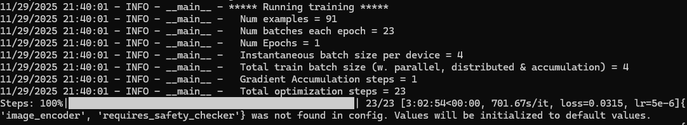

Дообучение своей модели по [этому датасету(cumulus clouds)](https://www.kaggle.com/datasets/zeesolver/cloiud-dataset/data)

Использованые технологии: DreamBooth, kaggle, stable-diffusion-v1-5

Настройки взяты [отсюда](https://github.com/huggingface/diffusers/tree/main/examples/dreambooth)

Команда: accelerate launch train_dreambooth.py \

--pretrained_model_name_or_path="$DIR_TO_HUB\models--runwayml--stable-diffusion-v1-5\snapshots\451f4fe16113bff5a5d2269ed5ad43b0592e9a14"
--output_dir="$DIR_TO_HUB"
--instance_prompt="image of cloudsss"
--resolution=512
--instance_data_dir=="$DIR_TO_REPO\3_Fine_Tuning\cumulus clouds"

На дообучение на 10гб vram ушло ~3 часа

промт: cumulus cloudsss

| Дотренерованная нейронка | Нетренерованная нейронка |
| ----------------------------------------------- | ----------------------------------------------- |
|                              |                     |
